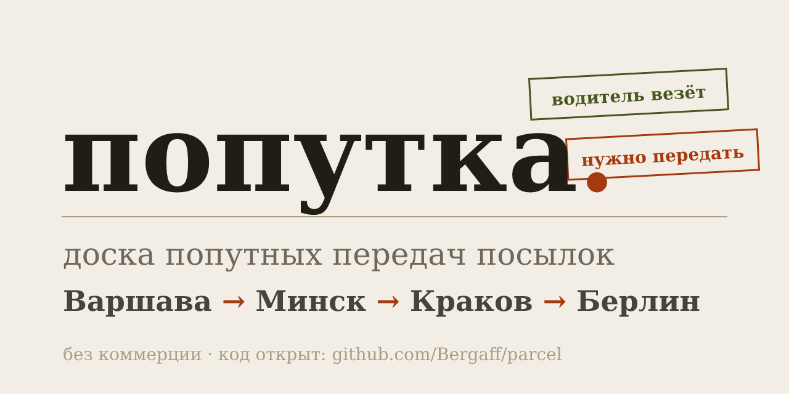

# попутка. — доска попутных передач



Сайт для поиска передачи посылок между городами и странами. Водители международных и межгородских рейсов публикуют, что готовы взять посылку; либо человек ищет, кто поможет передать. Плюс Telegram-бот, который собирает объявления из чатов водителей и релокантов и кладёт их на доску.

**Онлайн:** [parcel-61u.pages.dev](https://parcel-61u.pages.dev) · бот [@parcel_transfer_bot](https://t.me/parcel_transfer_bot). Проект некоммерческий: без рекламы, комиссий и платы.

**Стек:**
- **Cloudflare Pages** — статическая страница объявлений (`public/`)
- **Cloudflare Workers** + [Hono](https://hono.dev/) — парсер Telegram, API и бот
- Cloudflare **D1** (SQLite) — объявления, жалобы, учёт обработанных сообщений
- Cloudflare **KV** — сессии бота, rate limit
- Telegram Bot API — вебхук без сторонних SDK

## Что умеет

- **Доска объявлений**: фильтр по типу («водитель везёт» / «нужно передать»), маршруту, дате, поиск.
- **Города — по-русски**: и на сайте, и в ботe города пишут кириллицей (знакомую латиницу бот сам переводит: Warsaw → Варшава).
- **Архив**: заявки с прошедшей датой уходят с доски в архив, месяц остаются доступны по ссылке и в `/поиск` (можно написать автору), затем удаляются cron'ом (`[triggers]` в wrangler.toml, раз в сутки; ручной запуск — `POST /api/admin/archive`).
- **Поиск в боте**: `/поиск Город` (алиасы `/search`, `/серч`) — все заявки по городу в обе стороны, разделённые на «водители везут» и «нужно передать»; работает и в группах.
- **Публикация с сайта**: форма → модерация → публикация.
- **Telegram-бот**:
  - добавляется в чат и распознаёт объявления: маршрут, дата, вес, цена, контакты;
  - присылает вам в личку каждое распознанное объявление с кнопками «Одобрить / Отклонить»;
  - в личке: `/post` — мастер размещения, `/pending` — очередь модерации (для админов).
- **Жалобы**: 3 жалобы — объявление автоматически скрывается.
- **Правовые страницы**: «Условия использования» (`#/terms`) и «Политика приватности» (`#/privacy`).

---

## 1. Сначала: создать бота (отдельный аккаунт не нужен!)

Завести **новый Telegram-аккаунт-человека для парсинга НЕ нужно** — это называется «юзербот», он нарушает правила Telegram и его банят. Вам нужен **бот** — это отдельная «учётка», которую создаёт сам Telegram, без телефона и без вашего входа в неё:

1. Откройте **@BotFather** в своём Telegram.
2. `/newbot` → имя (например, `Попутка доска`) → юзернейм (например, `poputchka_ua_pl_bot`).
3. BotFather выдаст **токен** вида `123456789:AAAA...`. Это `BOT_TOKEN`.
4. Там же: `/setprivacy` → **Disable** (обязательно! иначе бот в группах не видит сообщения).
5. `/setjoingroups` → **Enable**.
6. Быстро проверьте: нажмите Start у своего бота (это нужно и для того, чтобы бот мог писать вам личные сообщения).

Ваш Telegram ID для модерации: напишите **@userinfobot** — он пришлёт `Id: 123456789`. Это `ADMIN_IDS`.

---

## 2. Создать ресурсы Cloudflare (D1 + KV)

## 2. Создать ресурсы Cloudflare (D1 + KV)

База D1 `poputchka-db` у вас уже создана — нужен её ID, а также ID KV-неймспейса (его, скорее всего, ещё нет — создайте). Всё делается в дашборде, CLI не обязателен:

1. **D1**: Storage & Databases → D1 SQL Database → `poputchka-db` → скопируйте поле **Database ID**.
2. **KV**: Storage & Databases → KV → **Create namespace** → имя `parcel-kv` → скопируйте **Namespace ID**.

Впишите оба идентификатора в `wrangler.toml` (вместо заглушек `REPLACE_WITH_YOUR_...`):

```toml
[[d1_databases]]
binding = "DB"
database_name = "poputchka-db"
database_id = "ВАШ_D1_ID"

[[kv_namespaces]]
binding = "KV"
id = "ВАШ_KV_ID"
```

⚠️ Пока стоят заглушки `REPLACE_WITH_...`, деплой падает на биндингах: сначала KV с ошибкой `10042 KV namespace ... is not valid`, после её исправления — D1 с `10021 ... must have a valid id`. Это ровно то, что видно в вашем последнем логе сборки.

Те же действия через CLI (если удобнее): `npx wrangler d1 create poputchka-db` и `npx wrangler kv namespace create parcel-kv` — в ответе будут ID.

## 3. Переменные и секреты воркера

**Несекретные настройки** теперь живут прямо в `wrangler.toml`, секция `[vars]` (их можно менять в репозитории):

| Переменная | Значение |
|---|---|
| `AUTO_APPROVE` | `"0"` — объявления через модерацию, `"1"` — публиковать сразу |
| `BOT_USERNAME` | юзернейм бота без @ (сейчас `parcel_transfer_bot`) |
| `SITE_URL` | адрес сайта на Pages (сейчас `https://parcel-61u.pages.dev`) |
| `REPLY_IN_GROUPS` | (опционально) `"1"` — бот подтверждает в чатах распознанные объявления |

Благодаря `keep_vars = true` в конфиге деплой **не удаляет** переменные, добавленные через дашборд.

**Секреты** (токены и ID админов) задаются один раз — через дашборд: Workers & Pages → `parcel` → Settings → Variables and Secrets → Add → Type: **Secret** (или через CLI ниже):

```bash
npx wrangler secret put BOT_TOKEN        # токен от @BotFather
npx wrangler secret put BOT_SECRET       # любая длинная случайная строка (секрет в URL вебхука)
npx wrangler secret put ADMIN_IDS        # ваш Telegram ID, напр. 123456789
npx wrangler secret put ADMIN_API_TOKEN  # случайный токен для админ-API
```

Секреты при деплое не удаляются и не переносятся в Git. Минимум для работы сайта — ничего из этого не нужно; для бота нужны `BOT_TOKEN`, `BOT_SECRET` и `ADMIN_IDS`.

---

## 4. Задеплоить Воркер (это не Pages!)

### Почему ваш билд падал

В логе сборки 08.09 две ключевые строки:

- `KV namespace 'REPLACE_WITH_YOUR_KV_NAMESPACE_ID' is not valid [code: 10042]` — в `wrangler.toml` стояла заглушка вместо ID KV-неймспейса;
- выше — предупреждение, что деплой **заменил бы настройки воркера локальными**: стёр бы переменные `AUTO_APPROVE`/`BOT_USERNAME`/`SITE_URL` и откатил `compatibility_date`.

Что исправлено в этом PR:

- `[vars]` с актуальными значениями перенесён в `wrangler.toml` (плюс `keep_vars = true` — дашбордные переменные больше не затираются);
- `compatibility_date` приведён к продовому `2026-09-06`;
- `npm run deploy` теперь сначала применяет миграции D1 (`wrangler d1 migrations apply DB --remote`), потом деплоит — таблицы в базе создаются автоматически;
- починен тест парсера (зависел от текущей даты) и ссылка на сайт в ответах бота.

Осталось подставить реальные ID ресурсов — см. раздел 2.

### Как деплоить (Workers Builds, ваш случай)

Ваш воркер `parcel` подключён к Git через Cloudflare (Workers Builds). В настройках проекта — Workers & Pages → `parcel` → Settings → Build → проверьте:

- **Build command**: `npm install` (или пусто — Workers Builds ставит зависимости сам)
- **Deploy command**: `npm run deploy` ← важно: так перед каждым деплоем применяются миграции D1; команда `npx wrangler deploy` миграции НЕ применяет

После мержа PR в `main` сборка запустится сама (или кнопку Retry в списке сборок).

### Какой проект для воркера?

В Cloudflare два разных типа проекта:

| Тип | Умеет | У нас |
|---|---|---|
| **Pages** | только статика (HTML/CSS/JS) | сайт. Настройки: Build пусто, **Output directory: public**, Deploy пусто |
| **Worker** | JS-код, D1, KV, вебхуки | парсер и API |

Если воркер создан через **Create Worker → Connect to Git** — это правильный путь. Если проект оказался типом **Pages** — воркер в нём не получится: уберите Deploy command, оставьте `public`, а воркер задеплойте одним из способов ниже.

### Вариант А. Авто-деплой через GitHub Actions

В репозитории есть шаблон workflow: `deploy-workflows/deploy-worker.yml.example`. GitHub App этого репозитория не может создать `.github/workflows/` сам (нет права `workflows`), поэтому скопируйте файл один раз:

```bash
mkdir -p .github/workflows
cp deploy-workflows/deploy-worker.yml.example .github/workflows/deploy-worker.yml
git add .github/workflows/deploy-worker.yml && git commit -m "add worker deploy workflow" && git push
```

Теперь в GitHub → репозиторий → Settings → Secrets and variables → Actions → New repository secret:
- `CLOUDFLARE_API_TOKEN` — токен из Cloudflare (My Profile → API Tokens → Create Token → шаблон **Edit Cloudflare Workers**)
- `CLOUDFLARE_ACCOUNT_ID` — ваш account id (справа на главной странице дашборда)

После этого каждый push в `main` применяет миграции и деплоит воркер. Если используете этот вариант — отключите Workers Builds, чтобы не деплоить дважды.

### Вариант Б. Локально, одной командой

```bash
npm install
npx wrangler login            # один раз
npm run deploy                # миграции D1 + деплой воркера
```


Имя воркера задано в `wrangler.toml` (`name = "parcel"` — по автопредложению Cloudflare). Адрес будет вида `https://parcel.<ваш-поддомен>.workers.dev` (Workers & Pages → воркер `parcel` → Settings → Domains).
---

## 5. Исправить Pages (страница объявлений)

Сейчас ваш продукт в Pages называется `parcel`, и там стоит сломанный «Deploy command: npx wrangler deploy». Настройки Pages должны быть:

- **Build command**: пусто
- **Output directory**: `public`
- **Deploy command**: пусто (уберите `npx wrangler deploy`)
- **Root directory**: `/`
- **Production branch**: `main`

Сохраните и перезапустите деплой. Страница будет собираться из папки `public/` при каждом push.

(Cloudflare просил обновить `wrangler.toml` для консистентности — сделано: `name = "parcel"` совпадает с именем проекта. `pages_build_output_dir` нужен не здесь: статика Pages задаётся полем **Output directory**, а не в `wrangler.toml`.)

---

## 6. Связать сайт и бота

Страница (Pages) не знает, где воркер. Пропишите адрес воркера в `public/index.html`:

```html
<script>
  window.POPUTKA_API_BASE = "https://parcel.ваш-поддомен.workers.dev";
</script>
```

Запушьте и перелейте Pages. Всё: сайт будет ходить в API воркера (CORS уже настроен).

Затем установите вебхук **на адрес воркера** (не Pages!). Локально:

```bash
cp .dev.vars.example .dev.vars   # впишите WORKER_URL = адрес воркера
npm run telegram:webhook
```

Либо вручную (без скрипта), откройте в браузере:

```
https://api.telegram.org/bot<BOT_TOKEN>/setWebhook?url=https://<адрес-воркера>/api/telegram/<BOT_SECRET>&allowed_updates=message,channel_post,callback_query
```

Проверка: `https://api.telegram.org/bot<BOT_TOKEN>/getWebhookInfo` → `url` должен указывать на воркер, `pending_update_count: 0` после первого сообщения.

---

## 7. Подключить бота к чатам и получать одобрения

1. **Добавьте бота в чаты.** Бот не может «подписаться» сам: его добавляет администратор чата (или вы, если вы админ). Напишите в чате `@имя_бота` или настройте бота как участника. Для супергрупп роль участника достаточно — главное, чтобы `/setprivacy` был **Disable**.
2. **Бот парсит только сообщения, пришедшие после добавления** — историю он не читает. Это нормально: объявления копятся вперёд.
3. **Вы в Telegram видите каждое объявление с кнопками.** Когда бот находит что-то похожее на объявление или кто-то размещает через сайт/личку, он пишет вам в личный чат (адрес `ADMIN_IDS`) с кнопками:
   - **Одобрить** — объявление появляется на сайте;
   - **Отклонить** — не появляется.
4. Очередь на модерацию: напишите боту `/pending` — покажет последние заявки с теми же кнопками.
5. Если хотите публиковать без модерации (например, на время старта): `AUTO_APPROVE=1` → `wrangler secret put AUTO_APPROVE`, введите `1`.

---

## Переменные окружения

| Переменная | Описание |
|---|---|
| `BOT_TOKEN` | токен бота от @BotFather |
| `BOT_SECRET` | секрет в URL вебхука `/api/telegram/:secret` |
| `SITE_URL` | публичный адрес сайта (Pages) для ссылок |
| `BOT_USERNAME` | юзернейм бота без @, для ссылки «Открыть бота» |
| `ADMIN_IDS` | Telegram ID модераторов через запятую |
| `AUTO_APPROVE` | `1` — публиковать без модерации |
| `ADMIN_API_TOKEN` | токен для `/api/admin/*` |
| `REPLY_IN_GROUPS` | `1` — бот отвечает в группах после распознавания (по умолчанию молчит) |

`WORKER_URL` используется только скриптом `set-webhook.mjs` (и `.dev.vars`), в воркер не передаётся.

---

## API

| Метод | Путь | Описание |
|---|---|---|
| GET | `/api/listings` | список (query: `type`, `from`, `to`, `date`, `q`, `page`) |
| GET | `/api/listings/:id` | карточка (считает просмотр) |
| POST | `/api/listings` | создать (лимит 10/час с IP → модерация) |
| POST | `/api/listings/:id/report` | жалоба (3 жалобы → скрытие) |
| GET | `/api/admin/pending` | очередь модерации (`Authorization: Bearer <ADMIN_API_TOKEN>`) |
| POST | `/api/admin/listings/:id/status` | `{ "status": "published" \| "rejected" }` |
| POST | `/api/telegram/:secret` | вебхук Telegram |
| GET | `/api/health` | проверка воркера |

---

## Локальная разработка

```bash
npm install
npm run db:local
cp .dev.vars.example .dev.vars
npm run dev                # http://localhost:8787
npm run typecheck && npm test
```

## Как улучшить парсер

Парсер в `src/parser.ts` работает эвристически (словарь городов, маршруты, даты, вес, цена). Понимает кириллицу и латиницу (Warszawa, Lviv, Krakow), разделители `—`, `->`, `=>`, `>>`, предлоги «до/в/из/от», даты «завтра», «в пятницу», «15.09», «15 сентября»/«5 жовтня».

Чтобы проверить, как бот понимает конкретное сообщение из чата, напишите ему в личку:

```
/parse Варшава — Львов, завтра, возьму посылку до 10 кг, 100 zł
```

Бот покажет, что он извлёк (маршрут, дату, вес, цену, контакт) и вердикт: возьмёт ли объявление на модерацию. Если бот что-то пропускает:

- расширяйте `CITY_FORMS` под свои чаты (особенно латиницей и местными написаниями);
- добавляйте фразы в `OFFER_HINTS` / `REQUEST_HINTS`;
- поднимайте порог `confidence` в `telegram.ts` (сейчас 0.7), если ловится лишнее.

## Структура

```
src/
  index.ts      — Hono: API, CORS, вебхук Telegram
  telegram.ts   — бот: группы, личка, модерация
  parser.ts     — парсер сообщений из чатов
  store.ts      — D1: объявления, жалобы, dedupe
  types.ts      — типы
  util.ts       — валидация, rate limit, утилиты
public/         — статика Pages (index.html, styles.css, app.js)
migrations/     — схема D1
scripts/        — установка/удаление вебхука
deploy-workflows/ — шаблон авто-деплоя воркера
```
